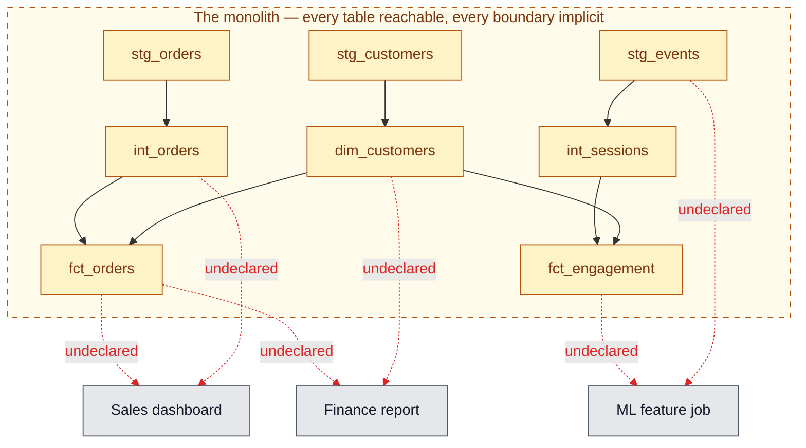
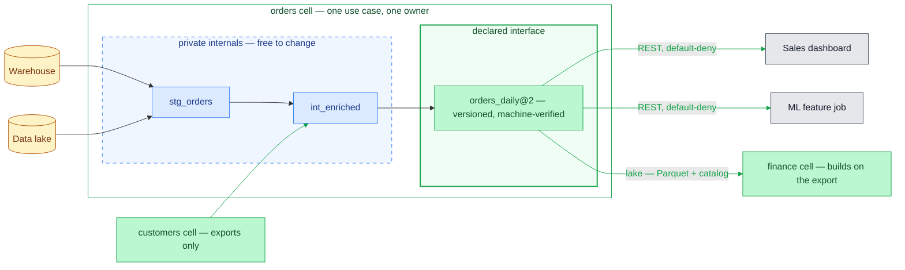

# Why composable data products?

You found this repo, you already run a data stack, probably some variant of
warehouse + dbt + Airflow, what does a CDP framework do for you?

Short version: not every use case belongs in the central warehouse, but
in most orgs it's the only paved road. Every new data product means a
ticket, a queue, and a shared bill. Datamake is the release valve. It gives you
a framework to deploy exactly what is needed for a particular data product with or without
the massive data monolithic stack.

## The gaps in the monolith stack

The warehouse + dbt + Airflow stack (the monolith) is genuinely good at what it was built
for: one shared data model, transformed in one or more DAGs, operated by one team. The
gaps come from exactly that shape. Every data team I have ever worked with
has their massive spahgetti DAG of DBT and/or SQLMesh models. Data producers have
no idea how their data is being used and are usually forced into implicit dependencies
with the entire enterprise. Data consumers wonder why their pipelines always break. If you
are lucky, there is a central team that holds the whole thing together with tribal knowledge
and human toil.

### Why does the monolith always end up failing in the same way?

In the monolith, a "use case" is a fuzzy region of the shared DAG. Every table
is reachable, so every consumer wires itself to whatever layer is convenient —
staging, intermediate, mart — and none of those dependencies are declared
anywhere. The boundary around a use case exists only in someone's head:

A composable data product draws the boundary precisely. Everything inside the
cell is private; the only way in is through the declared, versioned interface —
and the warehouse doesn't disappear, it just becomes one input among others.
The interface is served two ways: applications hit the REST API, while other
cells build on the same exports straight from the lake, in open formats:

Same dashboards, same jobs. The difference is that every arrow on the right is
declared, versioned, and enforced — and every arrow on the left is a Slack
thread waiting to happen.

### Specific failure modes of the monolith

**It serves no particular use case explicitly.** The monolith serves the
organization in aggregate. No table in it can tell you which use case it
exists for, what it promises that use case, or when it would be safe to
delete without extensive manual upkeep or additional tooling. Every consumer is
served implicitly, by the whole which means no consumer is served deliberately, by anything.

**It bakes in implicit requirements.** Each dashboard, notebook, and service
that reads a shared table silently turns its own needs into constraints on
that table — its columns, its grain, its refresh time. None of those
requirements are written down anywhere the producer can see. The schema
becomes load-bearing in ways nobody chose and nobody can enumerate.

**Nobody knows who owns or depends on what.** In a shared warehouse, every
table is an implicit shared dependency: grants control who can *read* it, but
nothing controls who *builds on* it. Any column you ship might be load-bearing
for a dashboard you've never heard of. So ownership is diffuse, the dependency
graph is massive, and every change starts with archaeology. Development slows to the speed of fear.

A data pipeline doesn't fix this, because a pipeline has no edges. Where does
it start? Where does it end? What does it promise? Who is allowed to use it?
Those answers live in someone's head, a wiki page, and three Slack threads.
The first person to build it moves fast; everyone after them pays.

## What a composable data product is

A **composable data product** — datamake calls the unit a **cell** — draws the
edges. It bundles four things that normally drift apart into one versioned,
deployable directory:

- **Logic** — the transforms, run in order, producing one atomic snapshot.
- **Output** — not "a table you hope is right," but a snapshot that is
  **machine-verified against a declared shape on every run**. If a declared
  column goes missing, or the declared grain isn't unique in the actual data,
  the build fails. The contract can't silently drift, because it is checked against
  the real data, not asserted in a doc.
- **Interface** — an explicit export list. Like `pub` in a programming
  language, it inverts the warehouse default: everything is **private unless
  declared**. Internals can churn freely; consumers only ever see the narrow
  surface you explicitly define as an interface.
- **Access** — whether the cell's exports are readable at all, and by which
  roles, declared in the same file and enforced default-deny at the serving
  API.

If you use dbt: yes, it has model contracts, tests, and versions. The
difference isn't that datamake checks a contract — it's *where the contract
lives*. dbt materializes back into the warehouse, where every table is still
reachable and verification is a test someone can forget to run. A cell's
contract is the **serving boundary**: non-exported tables have no route, and
the build *fails*, not warns, when a declared column goes missing or the
declared grain breaks. The check isn't optional, and the private parts are
actually unreachable.

The mental model is a **software module for data**. Inside: source reads,
scratch tables, intermediate state — all private, all owned by one clearly
named use case. Outside: a small, versioned public interface that *is* the
written-down requirements. The implicit dependencies the monolith bakes in
become explicit declarations a producer can see, and refuse.

## Why "composable"

Because cells have explicit, versioned interfaces, they can build on each
other the way code libraries do: a cell declares another cell's output as a
source, by name and version, without a central team brokering the handoff.
You get a graph of small products — each with a stable public surface, private
guts, and an owner — instead of one warehouse where everything depends on
everything and nobody knows how.

Datamake can do this because the data lake already decoupled the pieces: data as
Parquet on object storage, metadata in a SQL catalog. A cell fragments the
**control plane, not the data** — one logical lake, many small independent
operators, each with its own embedded engine (DuckDB) and its own catalog
binding. No cluster to stand up, no warehouse bill to justify, no ticket to
file. `datamk init` → `datamk run` → `datamk serve`, on your laptop, in
minutes.

## What you get by using Datamake

- **A contract that doesn't lie** — the interface is verified against actual
  output on every build, including grain uniqueness.
- **Atomic snapshots** — all transforms commit as one snapshot; consumers
  never see a half-built state.
- **Safe refactoring** — private-by-default internals; only declared exports
  get routes.
- **Versioned breaking changes** — a breaking change ships as a new major
  version with its own route, so `orders@1` and `orders@2` can be served at
  the same time and consumers migrate on their own clock instead of yours.
- **A deliberate release gesture** — once an export is marked
  `contract: supported`, `datamk release` freezes it at the current snapshot,
  so consumers see a stable, pinned version; experimental exports track latest
  until you promote them. Running and releasing are separate acts.
- **Portability** — Parquet + SQL catalog + an embedded engine. Your data is
  never held hostage by the tool. Promotion to an environment is a config
  profile, not a rewrite.

## What it is not

- **Not a warehouse replacement.** Composable Data Product patterns work with or without a central warehouse.
  Use your warehouse as inputs to your data products, or bypass the warehouse by reading straight from
  the data lake.
- **Not a semantic layer.** A graph of independently-authored contracts is not
  automatically one coherent data model.

## Where to go next

- [README](../../README.md) — the `cell.yaml` walkthrough and CLI reference.
- [Incremental loading](../guides/incremental.md) and
  [Kubernetes deployment](../guides/kubernetes.md) — the how-to guides.
- [ADRs](../adr/) — the reasoning behind specific design decisions.
